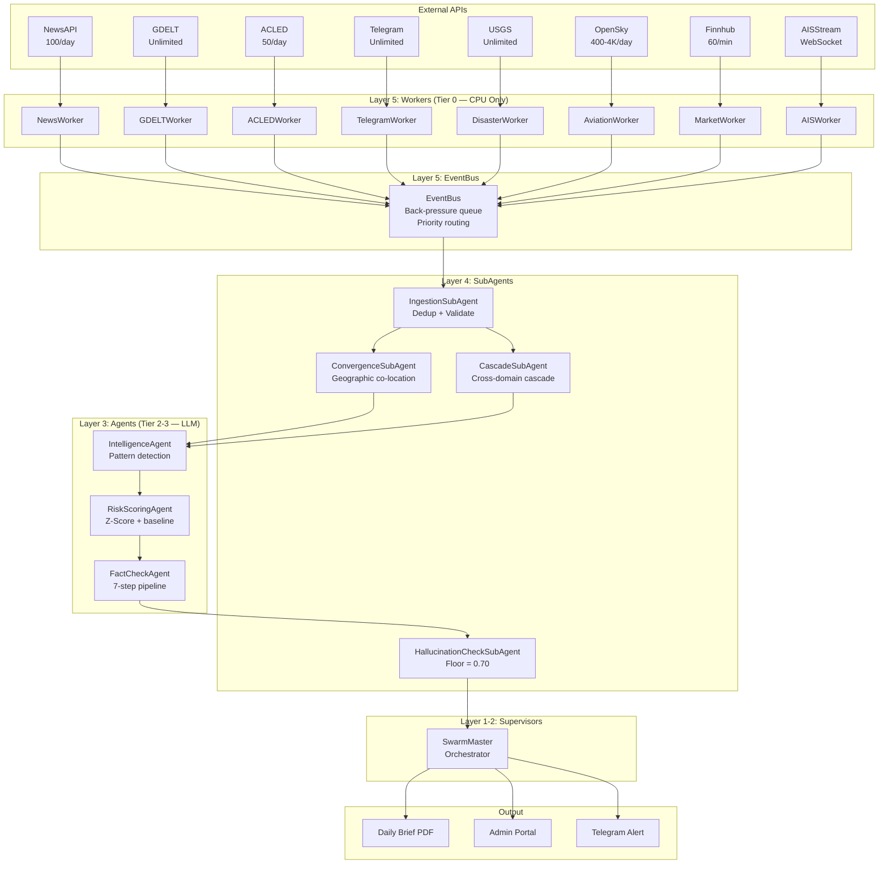
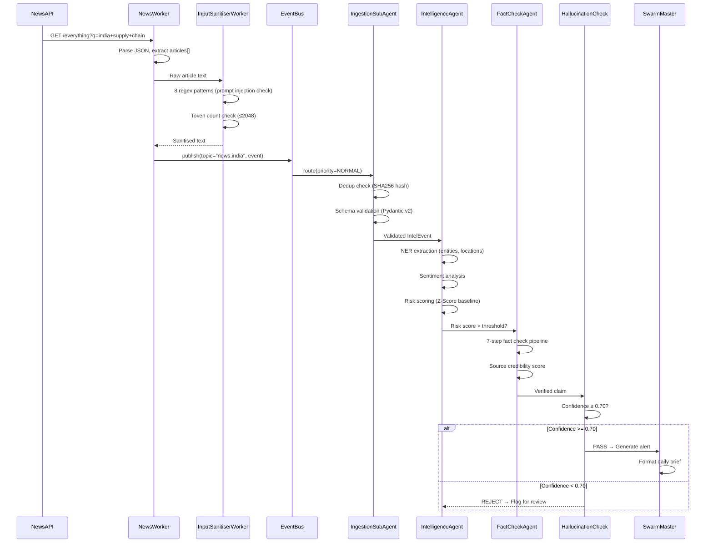
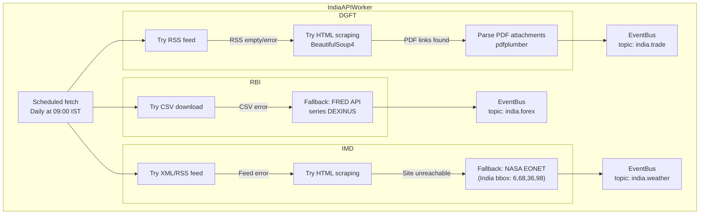

# Part XI: API Implementation Reference — Endpoints, Auth, Rate Limits, Schemas
## FA v2 | Last Updated: 2026-03-08 | Classification: Internal

> **PURPOSE**: Implementation-ready reference for all external API integrations. Every worker developer MUST consult this before writing API client code. All data sourced from official API documentation.

---

## 11.1 Ingestion APIs (Phase 2)

### NewsAPI
| Field | Value |
|-------|-------|
| **Base URL** | `https://newsapi.org/api/v2` |
| **Auth** | API key via `apiKey=` query param or `X-Api-Key` header |
| **Free Tier** | 100 requests/day, 1-month old articles max |
| **Rate Limit** | No per-second limit on free tier, just 100/day |
| **Key Endpoints** | `/everything?q={query}&language=en&sortBy=publishedAt` |
| | `/top-headlines?country=in&category=business` |
| **Response Format** | JSON (`status`, `totalResults`, `articles[]`) |
| **Worker** | `NewsWorker` |
| **Env Var** | `GEOSUPPLY_NEWSAPI_KEY` |
| **Python Example** | `requests.get(f"{base}/everything", params={"q": "india supply chain", "apiKey": key})` |
| **Gotcha** | Free tier returns max 100 results per request. Use `page` + `pageSize` for pagination. Dev keys show `[Removed]` for some fields. |

### GDELT 2.0
| Field | Value |
|-------|-------|
| **Base URL** | `https://api.gdeltproject.org/api/v2` |
| **Auth** | None required |
| **Free Tier** | Unlimited (fully open) |
| **Rate Limit** | ~5 requests/second (soft limit, throttled if abused) |
| **Key Endpoints** | `/doc/doc?query={query}&mode=ArtList&format=json` |
| | `/geo/geo?query={query}&format=GeoJSON` |
| **Response Format** | JSON or CSV |
| **Worker** | `GDELTWorker` |
| **Env Var** | None |
| **Gotcha** | Returns algorithmically extracted events — medium confidence. Always corroborate with ACLED. Data updates every 15 minutes. |

### ACLED
| Field | Value |
|-------|-------|
| **Base URL** | `https://api.acleddata.com/acled/read` |
| **Auth** | API key + email via query params: `key=` + `email=` |
| **Free Tier** | Free for researchers/analysts (registration required) |
| **Rate Limit** | ~50 requests/day (soft limit) |
| **Key Endpoints** | `?terms=accept&limit=500&country=India&event_date={date}&event_date_where=BETWEEN` |
| **Response Format** | JSON (`success`, `data[]`, `count`) |
| **Worker** | `ACLEDWorker` |
| **Env Var** | `GEOSUPPLY_ACLED_KEY`, `GEOSUPPLY_ACLED_EMAIL` |
| **Gotcha** | Human-curated data — HIGHER quality than GDELT. Use as ground truth source. Registration can take 1-2 days. |

### Telegram Bot API
| Field | Value |
|-------|-------|
| **Base URL** | `https://api.telegram.org/bot{token}` |
| **Auth** | Bot token via URL path |
| **Free Tier** | Unlimited |
| **Rate Limit** | 30 messages/sec to same chat, 20 messages/min to same group |
| **Key Endpoints** | `/getUpdates?offset={id}&limit=100` |
| **Worker** | `TelegramWorker` |
| **Env Var** | `GEOSUPPLY_TELEGRAM_BOT_TOKEN` |

---

## 11.2 Disaster APIs (Phase 15 — DisasterWorker)

### USGS Earthquake API
| Field | Value |
|-------|-------|
| **Base URL** | `https://earthquake.usgs.gov/fdsnws/event/1` |
| **Auth** | None required |
| **Free Tier** | Unlimited (US government open data) |
| **Rate Limit** | No stated limit (respectful usage expected; max 20,000 results per query) |
| **Key Endpoints** | `/query?format=geojson&starttime={start}&endtime={end}&minmagnitude={mag}` |
| | `/query?format=geojson&latitude={lat}&longitude={lon}&maxradiuskm={km}` |
| | `/count?format=geojson&starttime={start}&endtime={end}` |
| **Response Format** | GeoJSON (`type: "FeatureCollection"`, `features[]`, `metadata`) |
| **Worker** | `DisasterWorker` |
| **Env Var** | None |
| **Python Example** | `requests.get(f"{base}/query", params={"format": "geojson", "starttime": "2024-01-01", "minmagnitude": 4.5})` |
| **Gotcha** | Max 20,000 events per query. Use time windows to paginate. Supports bbox filtering: `minlatitude`, `maxlatitude`, `minlongitude`, `maxlongitude`. India bbox: `6,68,36,98`. |

### NASA EONET v3
| Field | Value |
|-------|-------|
| **Base URL** | `https://eonet.gsfc.nasa.gov/api/v3` |
| **Auth** | None required |
| **Free Tier** | Unlimited (US government open data) |
| **Rate Limit** | No stated limit |
| **Key Endpoints** | `/events?status=open&limit=50&days=30` |
| | `/events?category=severeStorms,wildfires&status=open` |
| | `/events/geojson?bbox={west},{north},{east},{south}` |
| | `/events?start={YYYY-MM-DD}&end={YYYY-MM-DD}` |
| | `/events?magID=mag_kts&magMin=1.50&magMax=20` |
| **Response Format** | JSON or GeoJSON (use `/events/geojson` endpoint) |
| **Categories** | `drought`, `dustHaze`, `earthquakes`, `floods`, `landslides`, `severeStorms`, `tempExtremes`, `volcanoes`, `waterColor`, `wildfires` |
| **Worker** | `DisasterWorker` |
| **Env Var** | None |
| **Gotcha** | Returns event geometries as Point or Polygon. Use `days` parameter for recent events. Combine with USGS for earthquake deduplication. |

### GDACS (Global Disaster Alert)
| Field | Value |
|-------|-------|
| **Base URL** | `https://www.gdacs.org/gdacsapi/api/events` |
| **Auth** | None required |
| **Free Tier** | Unlimited |
| **Rate Limit** | ~1 request/second (soft limit) |
| **Key Endpoints** | `/geteventlist/SEARCH?eventlist=EQ,TC,FL,VO&fromDate={date}&toDate={date}` |
| | `/getreport?eventtype=EQ&eventid={id}` |
| **Event Types** | `EQ` (earthquake), `TC` (tropical cyclone), `FL` (flood), `VO` (volcano), `DR` (drought) |
| **Response Format** | XML (default) or GeoJSON via RSS feed |
| **Worker** | `DisasterWorker` |
| **Env Var** | None |
| **Gotcha** | Default response is XML. Parse with `xml.etree.ElementTree`. GDACS provides alert *levels* (Green/Orange/Red) — use for severity classification. |

---

## 11.3 Aviation & Military APIs (Phase 15 — AviationWorker)

### OpenSky Network REST API (Complete Spec from Official Docs)
| Field | Value |
|-------|-------|
| **Base URL** | `https://opensky-network.org/api` |
| **Auth** | **OAuth2 Client Credentials** — basic auth DEAD since March 18, 2026 |
| **Token URL** | `https://auth.opensky-network.org/auth/realms/opensky-network/protocol/openid-connect/token` |
| **Token Expiry** | 30 minutes (auto-refresh 30s before expiry) |
| **Worker** | `AviationWorker` |
| **Env Var** | `GEOSUPPLY_OPENSKY_CLIENT_ID`, `GEOSUPPLY_OPENSKY_CLIENT_SECRET` |

#### All 8 Endpoints

| Endpoint | Method | Description | Constraints |
|----------|--------|-------------|-------------|
| `/states/all` | GET | All aircraft state vectors worldwide | Rate-limited (see credits) |
| `/states/all?lamin=6&lomin=68&lamax=36&lomax=98` | GET | India bounding box filter | ~900 sq deg = 4 credits |
| `/states/own` | GET | Your own receiver's state vectors | **No rate limit** |
| `/flights/all?begin={unix}&end={unix}` | GET | All flights in time interval | Max 2-hour window |
| `/flights/aircraft?icao24={hex}&begin={unix}&end={unix}` | GET | Flights by specific aircraft | Max 2-day window |
| `/flights/arrival?airport={ICAO}&begin={unix}&end={unix}` | GET | Arrivals at airport | Max 2-day window |
| `/flights/departure?airport={ICAO}&begin={unix}&end={unix}` | GET | Departures from airport | Max 2-day window |
| `/tracks/all?icao24={hex}&time=0` | GET | Aircraft track/waypoints | Max 30 days history. Experimental. |

#### Credit System (Area-Based — NOT Flat!)

| Area (sq degrees) | Credits | Example Coverage |
|-------------------|---------|-----------------|
| 0 - 25 (<500×500km) | 1 | Single city/port area |
| 25 - 100 (<1000×1000km) | 2 | Regional (e.g., Gujarat coast) |
| 100 - 400 (<2000×2000km) | 3 | Large region |
| >400 or no filter | 4 | Full world / India bbox (30×30 = ~900 sq deg) |

> **India bbox = 30° lat × 30° lon = ~900 sq degrees = 4 credits per call.**
> With 4000 credits/day → **max 1000 India-wide polls/day** (1 every ~86 seconds).
> Optimize: split India into 4 sub-regions (<25 sq deg each) = 1 credit each = 4000 polls/day.

#### Rate Limits by User Type

| User Type | Credits/Day | Time Resolution | History |
|-----------|-------------|-----------------|---------|
| Anonymous | 400 | 10 seconds | Current only (`time` param ignored) |
| Registered | 4,000 | 5 seconds | Up to 1 hour |
| Active contributor (≥30% feeder uptime) | 8,000 | 5 seconds | Up to 1 hour |
| `/states/own` endpoint | **Unlimited** | Best available | Full |

**Headers**: `X-Rate-Limit-Remaining` (credits left), `429 Too Many Requests` when exhausted, `X-Rate-Limit-Retry-After-Seconds` (retry timer).

#### State Vector Fields (18-element array — index 0-17)

| Idx | Property | Type | Notes |
|-----|----------|------|-------|
| 0 | `icao24` | string | Hex transponder address (e.g., `"3c6444"`) |
| 1 | `callsign` | string | 8 chars, nullable |
| 2 | `origin_country` | string | Inferred from ICAO24 |
| 3 | `time_position` | int | Unix timestamp, nullable if no position in 15s |
| 4 | `last_contact` | int | Unix timestamp of any valid message |
| 5 | `longitude` | float | WGS-84, nullable |
| 6 | `latitude` | float | WGS-84, nullable |
| 7 | `baro_altitude` | float | Meters, nullable |
| 8 | `on_ground` | bool | Surface position report |
| 9 | `velocity` | float | m/s ground speed, nullable |
| 10 | `true_track` | float | Degrees from north (0°=N), nullable |
| 11 | `vertical_rate` | float | m/s (+climb, -descend), nullable |
| 12 | `sensors` | int[] | Receiver IDs, null if no filter |
| 13 | `geo_altitude` | float | Geometric altitude (meters), nullable |
| 14 | `squawk` | string | Transponder code, nullable |
| 15 | `spi` | bool | Special Purpose Indicator |
| 16 | `position_source` | int | 0=ADS-B, 1=ASTERIX, 2=MLAT, 3=FLARM |
| 17 | `category` | int | 0-20 aircraft type (see below) |

#### Aircraft Category Enum (index 17)

| Value | Category | GeoSupply Relevance |
|-------|----------|---------------------|
| 0 | No info | — |
| 2 | Light (<15,500 lbs) | General aviation |
| 3 | Small (15,500-75,000 lbs) | Regional jets |
| 4 | Large (75,000-300,000 lbs) | Commercial airlines |
| 5 | High Vortex Large (B-757) | Cargo/commercial |
| 6 | Heavy (>300,000 lbs) | **Military transport, cargo (C-17, C-5)** |
| 7 | High Performance (>5g, 400kt) | **Military fighter jets** |
| 8 | Rotorcraft | **Military helicopters** |
| 14 | UAV | **Military drones** |
| 15 | Space/Trans-atmospheric | — |

> **For GeoSupply AviationWorker**: Filter on categories 6, 7, 8, 14 for military intelligence. Categories 4, 5 for cargo/supply chain tracking.

#### OAuth2 Token Manager (from official docs — production-ready)

```python
import requests
from datetime import datetime, timedelta

TOKEN_URL = "https://auth.opensky-network.org/auth/realms/opensky-network/protocol/openid-connect/token"
TOKEN_REFRESH_MARGIN = 30  # seconds before expiry to proactively refresh


class OpenSkyTokenManager:
    """Auto-refreshing OAuth2 token manager for OpenSky API."""

    def __init__(self, client_id: str, client_secret: str):
        self.client_id = client_id
        self.client_secret = client_secret
        self.token = None
        self.expires_at = None

    def get_token(self) -> str:
        """Return valid access token, auto-refreshing if needed."""
        if self.token and self.expires_at and datetime.now() < self.expires_at:
            return self.token
        return self._refresh()

    def _refresh(self) -> str:
        """Fetch new token from OpenSky auth server."""
        r = requests.post(TOKEN_URL, data={
            "grant_type": "client_credentials",
            "client_id": self.client_id,
            "client_secret": self.client_secret,
        })
        r.raise_for_status()
        data = r.json()
        self.token = data["access_token"]
        expires_in = data.get("expires_in", 1800)
        self.expires_at = datetime.now() + timedelta(
            seconds=expires_in - TOKEN_REFRESH_MARGIN
        )
        return self.token

    def headers(self) -> dict:
        """Return Authorization headers with valid Bearer token."""
        return {"Authorization": f"Bearer {self.get_token()}"}


# Usage in AviationWorker:
# tokens = OpenSkyTokenManager(os.environ["GEOSUPPLY_OPENSKY_CLIENT_ID"],
#                               os.environ["GEOSUPPLY_OPENSKY_CLIENT_SECRET"])
# resp = requests.get(BASE + "/states/all?lamin=6&lomin=68&lamax=36&lomax=98",
#                     headers=tokens.headers())
```

#### API Block Detection & Health Check

```python
async def _check_opensky_health(self) -> dict:
    """Detect if OpenSky API is blocked, rate-limited, or healthy."""
    try:
        resp = await self._http.get(
            "https://opensky-network.org/api/states/all?lamin=28&lomin=77&lamax=29&lomax=78",
            headers=self.tokens.headers(),
            timeout=15
        )
        remaining = int(resp.headers.get("X-Rate-Limit-Remaining", -1))
        if resp.status_code == 200:
            return {"status": "healthy", "credits_remaining": remaining}
        elif resp.status_code == 429:
            retry_after = resp.headers.get("X-Rate-Limit-Retry-After-Seconds", "?")
            return {"status": "rate_limited", "retry_after_seconds": retry_after}
        elif resp.status_code == 401:
            return {"status": "auth_failed", "action": "refresh_token"}
        elif resp.status_code == 403:
            return {"status": "BLOCKED", "action": "check_account_status"}
        else:
            return {"status": "unknown_error", "code": resp.status_code}
    except Exception as e:
        return {"status": "unreachable", "error": str(e)}
```

#### Do We Need Trino?

> **NO.** Trino/MinIO is OpenSky's interface for historical data spanning months/years. GeoSupply's `AviationWorker` does **real-time / near-real-time tracking** (current + up to 1 hour history). The REST API is sufficient. Trino would only be needed if we wanted to analyze years of historical flight patterns — which is out of scope for our intelligence pipeline.

#### Key Gotchas Summary
- ⚠️ Basic auth **DEAD** since March 18, 2026 — OAuth2 only
- India bbox (30°×30°) costs **4 credits per call** — optimize with sub-regions
- Flights/tracks endpoints updated by **batch process at night** — not real-time
- `/states/own` is **unlimited** — if we deploy a receiver, zero rate limit concern
- Token expires every **30 minutes** — use `OpenSkyTokenManager` class above
- **Monitor `X-Rate-Limit-Remaining` header** on every response for early warning

### FAA NASSTATUS
| Field | Value |
|-------|-------|
| **Base URL** | `https://nasstatus.faa.gov/api/airport-status-information` |
| **Auth** | None |
| **Free Tier** | Unlimited |
| **Key Endpoints** | Default endpoint returns all US airports' delay info |
| **Worker** | `AviationWorker` |
| **Gotcha** | US airports only. Limited relevance for India-centric intelligence but valuable for US supply chain impact. |

---

## 11.4 Financial & Market APIs (Phase 15 — MarketWorker)

### Finnhub
| Field | Value |
|-------|-------|
| **Base URL** | `https://finnhub.io/api/v1` |
| **Auth** | API key via `token=` query param or `X-Finnhub-Token` header |
| **Free Tier** | 60 API calls/minute, 30 calls/second max |
| **Rate Limit** | 429 status code on exceed |
| **Key Endpoints** | `/quote?symbol={sym}` — Real-time quote (c, d, dp, h, l, o, pc) |
| | `/company-news?symbol={sym}&from={date}&to={date}` — Company news |
| | `/news?category=general` — Market news |
| | `/stock/candle?symbol={sym}&resolution=D&from={unix}&to={unix}` — OHLCV candles |
| | `/calendar/economic?from={date}&to={date}` — Economic calendar |
| **Response Format** | JSON |
| **Worker** | `MarketWorker` |
| **Env Var** | `GEOSUPPLY_FINNHUB_KEY` |
| **Python Library** | `pip install finnhub-python` |
| **Gotcha** | Free tier supports US stocks, some forex, crypto. 60 calls/min is generous for our use case. WebSocket available for real-time streaming (`wss://ws.finnhub.io`). |

### Yahoo Finance (yfinance)
| Field | Value |
|-------|-------|
| **Base URL** | N/A (Python library `yfinance`) |
| **Auth** | None |
| **Free Tier** | Unlimited (scrapes public data) |
| **Rate Limit** | ~2,000 requests/hour (unofficial, varies) |
| **Key Usage** | `yf.Ticker("^NSEI").history(period="5d")` — NSE Nifty |
| | `yf.download(["^NSEI", "CRUDEOIL.NS"], period="1mo")` — Bulk download |
| **Worker** | `MarketWorker` |
| **Install** | `pip install yfinance` |
| **Gotcha** | Unofficial API — Yahoo may break it anytime. Use as secondary source behind Finnhub. Supports Indian market tickers (`.NS` suffix for NSE, `.BO` for BSE). |

### CoinGecko
| Field | Value |
|-------|-------|
| **Base URL** | `https://api.coingecko.com/api/v3` |
| **Auth** | None (free tier), API key for Pro |
| **Free Tier** | 10-30 calls/minute |
| **Key Endpoints** | `/simple/price?ids=bitcoin,ethereum&vs_currencies=inr` |
| | `/coins/{id}/market_chart?vs_currency=inr&days=30` |
| **Worker** | `MarketWorker` |
| **Gotcha** | Rate limits are strict. Cache aggressively (15-min TTL). Use `vs_currencies=inr` for INR pricing. |

---

## 11.5 Economic & Energy APIs (Phase 15)

### FRED (Federal Reserve Economic Data)
| Field | Value |
|-------|-------|
| **Base URL** | `https://api.stlouisfed.org/fred` |
| **Auth** | API key via `api_key=` param |
| **Free Tier** | Unlimited (US government) |
| **Key Endpoints** | `/series/observations?series_id=DCOILWTICO&api_key={key}&file_type=json` |
| **Relevant Series** | `DCOILWTICO` (WTI Oil), `DCOILBRENTEU` (Brent), `DGS10` (10Y Treasury), `CPIAUCSL` (CPI), `UNRATE` (Unemployment) |
| **Worker** | `EconomicWorker` |
| **Env Var** | `GEOSUPPLY_FRED_KEY` |

### EIA (Energy Information Administration)
| Field | Value |
|-------|-------|
| **Base URL** | `https://api.eia.gov/v2` |
| **Auth** | API key via `api_key=` param |
| **Free Tier** | Unlimited (US government, registration required) |
| **Key Endpoints** | `/petroleum/pri/spt/data/?api_key={key}&frequency=daily&data[0]=value` |
| **Worker** | `EnergyWorker` |
| **Env Var** | `GEOSUPPLY_EIA_KEY` |

---

## 11.6 Maritime & Other APIs

### AISStream (WebSocket)
| Field | Value |
|-------|-------|
| **Base URL** | `wss://stream.aisstream.io/v0/stream` |
| **Auth** | API key in WebSocket handshake message |
| **Free Tier** | Free registration, real-time AIS data |
| **Key Message** | `{"APIKey": "{key}", "BoundingBoxes": [[[6,68],[36,98]]]}` |
| **Response Format** | JSON messages with MMSI, position, speed, course, vessel type |
| **Worker** | `AISWorker` |
| **Env Var** | `GEOSUPPLY_AISSTREAM_KEY` |
| **Gotcha** | WebSocket-based — use `websockets` library. Connection may drop. Implement auto-reconnect with 30s exponential backoff. Store last-known positions in SQLite. |

### Cloudflare Radar
| Field | Value |
|-------|-------|
| **Base URL** | `https://api.cloudflare.com/client/v4/radar` |
| **Auth** | Bearer token via `Authorization` header |
| **Free Tier** | Free with Cloudflare account |
| **Key Endpoints** | `/http/summary/ip_version`, `/attacks/layer3/summary`, `/bgp/routes/stats` |
| **Worker** | `CyberThreatWorker` |
| **Env Var** | `GEOSUPPLY_CLOUDFLARE_RADAR_TOKEN` |

---

## 11.7 LLM & Infrastructure APIs (Phase 0-1)

### Groq API
| Field | Value |
|-------|-------|
| **Base URL** | `https://api.groq.com/openai/v1` |
| **Auth** | Bearer token via `Authorization` header |
| **Free Tier** | 14,400 req/day, 30 req/min (Llama models) |
| **Key Endpoints** | `/chat/completions` (OpenAI-compatible) |
| **Worker** | All Tier 2-3 workers via `LLMRouter` |
| **Env Var** | `GEOSUPPLY_GROQ_KEY` |
| **Gotcha** | Primary LLM provider. Rate limits vary by model. Use `llama-3.1-70b-versatile` for analysis, `llama-3.1-8b-instant` for classification. |

### Ollama (Local)
| Field | Value |
|-------|-------|
| **Base URL** | `http://localhost:11434/api` |
| **Auth** | None (local) |
| **Free Tier** | Unlimited (runs locally) |
| **Key Endpoints** | `/generate`, `/chat`, `/embeddings` |
| **Worker** | Fallback LLM when Groq unavailable |
| **Env Var** | `GEOSUPPLY_OLLAMA_URL` (default: `http://localhost:11434`) |
| **Gotcha** | Requires local GPU/CPU resources. Models must be pulled first (`ollama pull llama3.1`). Slower than Groq but zero cost. |

### Claude API (Anthropic)
| Field | Value |
|-------|-------|
| **Base URL** | `https://api.anthropic.com/v1` |
| **Auth** | API key via `x-api-key` header |
| **Free Tier** | Pay-per-use (~₹0.25/call) |
| **Key Endpoints** | `/messages` |
| **Worker** | Emergency fallback via `MoAFallbackAgent` |
| **Env Var** | `GEOSUPPLY_CLAUDE_KEY` |
| **Gotcha** | ⚠️ ONLY use when Groq + Ollama both fail. Budget impact: each call costs ~₹0.25. Hard limit: max 10 calls/day. |

### ChromaDB
| Field | Value |
|-------|-------|
| **Base URL** | N/A (Python library, local persistent storage) |
| **Auth** | None (local) |
| **Free Tier** | Unlimited (local) |
| **Install** | `pip install chromadb` |
| **Key Usage** | `client = chromadb.PersistentClient(path="./data/chromadb")` |
| **Worker** | `RAGSubAgent`, `KnowledgeGraphAgent` |
| **Env Var** | `GEOSUPPLY_CHROMADB_PATH` |

### Supabase
| Field | Value |
|-------|-------|
| **Base URL** | `https://{project}.supabase.co/rest/v1` |
| **Auth** | API key via `apikey` header + `Authorization: Bearer {key}` |
| **Free Tier** | 500MB database, 1GB file storage, 50K monthly active users |
| **Key Endpoints** | PostgREST auto-generated from tables |
| **Worker** | All workers for persistent storage |
| **Env Var** | `GEOSUPPLY_SUPABASE_URL`, `GEOSUPPLY_SUPABASE_KEY` |

---

## 11.8 India-Specific APIs (Phase 2-4)

### Google Maps Platform
| Field | Value |
|-------|-------|
| **Base URL** | `https://maps.googleapis.com/maps/api` |
| **Auth** | API key via `key=` param |
| **Free Tier** | $200/month credits (~₹16,700) |
| **Key Endpoints** | `/geocode/json`, `/directions/json`, `/distancematrix/json` |
| **Worker** | `GeospatialAgent` |
| **Env Var** | `GEOSUPPLY_GOOGLE_MAPS_KEY` |

### ULIP (Unified Logistics Interface Platform)
| Field | Value |
|-------|-------|
| **Base URL** | `https://ulip.dpiit.gov.in/ulip/v1.0.0` |
| **Auth** | OAuth2 Bearer token |
| **Free Tier** | Free (government platform) |
| **Key Endpoints** | `/VAHAN/01` (vehicle), `/SARATHI/01` (driver), `/FASTag/01` (toll), `/FOIS/01` (rail freight), `/ICEGATE/01` (customs) |
| **Worker** | `IndiaAPIWorker` |
| **Env Var** | `GEOSUPPLY_ULIP_TOKEN` |
| **Gotcha** | Requires registration with DPIIT. Sandbox available for testing. 5 core endpoints cover vehicle, driver, toll, rail, customs data. |

### DGFT (Directorate General of Foreign Trade)
| Field | Value |
|-------|-------|
| **Base URL** | `https://www.dgft.gov.in/CP/` (website scraping) |
| **Auth** | None (public data) |
| **Worker** | `IndiaAPIWorker` |
| **Gotcha** | No formal API — requires scraping or RSS. Trade policy notifications available as PDFs. |

### IMD (India Meteorological Department)
| Field | Value |
|-------|-------|
| **Base URL** | `https://mausam.imd.gov.in/` |
| **Auth** | None (public data) |
| **Worker** | `DisasterWorker` (India-specific weather) |
| **Gotcha** | Limited JSON API. XML/RSS feeds for warnings. Combine with NWS for international coverage. |

### RBI (Reserve Bank of India)
| Field | Value |
|-------|-------|
| **Base URL** | `https://www.rbi.org.in/scripts/ReferenceRateArchive.aspx` |
| **Auth** | None (public data) |
| **Worker** | `MarketWorker` (INR forex rates) |
| **Gotcha** | Reference rates published daily. No REST API — requires scraping. Consider using FRED for USD/INR proxy. |

### LDB (Logistics Data Bank)
| Field | Value |
|-------|-------|
| **Base URL** | `https://ldb.gov.in` |
| **Auth** | Registration required |
| **Worker** | `IndiaAPIWorker` (container tracking) |
| **Gotcha** | Tracks container movement across Indian ports. API access requires NICDC registration. |

### ⚠️ India APIs — Plan B: Scrape-Dependent Fallback Strategies

> **Context (R20)**: DGFT, IMD, and RBI do not have formal REST APIs. All data is published on government websites as HTML pages, PDFs, or RSS/XML feeds. The `IndiaAPIWorker` MUST implement fallback parsing strategies.

#### DGFT — Trade Policy Notifications
```
Primary:   RSS feed at https://www.dgft.gov.in/CP/ (if available)
Fallback:  Web scraping with BeautifulSoup4 + requests
Data:      Trade circulars, policy notifications, ITC-HS updates
Parser:    feedparser (RSS) → bs4 (HTML) → pdfplumber (PDF attachments)
Schedule:  Daily at 09:00 IST (DGFT publishes during business hours)
```

```python
# Plan B implementation pattern for DGFT
import feedparser, pdfplumber, requests
from bs4 import BeautifulSoup

class DGFTScraper:
    URLS = {
        "notifications": "https://www.dgft.gov.in/CP/?opt=notification",
        "circulars": "https://www.dgft.gov.in/CP/?opt=circular",
    }

    async def fetch(self) -> list[dict]:
        # Step 1: Try RSS feed first
        feed = feedparser.parse(self.URLS["notifications"])
        if feed.entries:
            return [self._parse_entry(e) for e in feed.entries]

        # Step 2: Fallback to HTML scraping
        resp = await self._http.get(self.URLS["notifications"])
        soup = BeautifulSoup(resp.text, "html.parser")
        rows = soup.select("table.views-table tbody tr")
        return [self._parse_row(r) for r in rows]

    def _extract_pdf_text(self, pdf_url: str) -> str:
        """Extract text from PDF notifications."""
        resp = requests.get(pdf_url)
        with pdfplumber.open(io.BytesIO(resp.content)) as pdf:
            return "\n".join(p.extract_text() or "" for p in pdf.pages)
```

#### IMD — Weather Warnings
```
Primary:   XML/RSS feed at https://mausam.imd.gov.in/
Fallback:  HTML scraping of warning pages
Data:      Cyclone warnings, rainfall alerts, temperature extremes
Parser:    feedparser (XML) → bs4 (HTML)
Schedule:  Every 6 hours (IMD updates 4x/day: 00, 06, 12, 18 UTC)
Supplement: NASA EONET + NWS for international weather coverage
```

#### RBI — Forex Reference Rates
```
Primary:   CSV download at https://www.rbi.org.in/scripts/ReferenceRateArchive.aspx
Fallback:  FRED API — series DEXINUS (USD/INR exchange rate)
Data:      Daily reference rates for USD/EUR/GBP/JPY against INR
Parser:    pandas.read_csv() for RBI CSV → FRED API for USD/INR proxy
Schedule:  Daily at 13:30 IST (RBI publishes around 1:30 PM)
```

```python
# RBI with FRED fallback
async def get_inr_rate(self) -> float:
    try:
        # Primary: RBI direct
        resp = await self._http.get(
            "https://www.rbi.org.in/.../ReferenceRateArchive.aspx",
            params={"dt": today}
        )
        return self._parse_rbi_csv(resp.text)
    except Exception:
        # Fallback: FRED USD/INR
        resp = await self._http.get(
            "https://api.stlouisfed.org/fred/series/observations",
            params={"series_id": "DEXINUS", "api_key": self.fred_key,
                    "file_type": "json", "sort_order": "desc", "limit": 1}
        )
        return float(resp.json()["observations"][0]["value"])
```

#### Required Python Libraries for Plan B
```bash
pip install feedparser beautifulsoup4 pdfplumber lxml
```

---

## 11.8a Data Flow Diagrams — Ingestion to Intelligence

### Diagram 1: Main Ingestion → Intelligence Pipeline



### Diagram 2: Single Event Lifecycle (NewsAPI → Alert)



### Diagram 3: India API Fallback Flow (R20 Mitigation)



## 11.9 v10 APIs — Cyber, Marketing, OSINT (Phase 4-11)

### Twitter/X API v2
| Field | Value |
|-------|-------|
| **Base URL** | `https://api.twitter.com/2` |
| **Auth** | OAuth 2.0 Bearer token |
| **Free Tier** | Basic: 10K reads/month (tweets), 1 app |
| **Key Endpoints** | `/tweets`, `/users/{id}/tweets` |
| **Worker** | `TwitterAPIWorker` |
| **Env Var** | `GEOSUPPLY_TWITTER_BEARER_TOKEN` |
| **Gotcha** | Free tier is very limited (10K reads). For GeoSupply marketing, not ingestion. |

### SendGrid / Resend
| Field | Value |
|-------|-------|
| **Base URL** | `https://api.sendgrid.com/v3` or `https://api.resend.com` |
| **Auth** | API key via `Authorization: Bearer` |
| **Free Tier** | SendGrid: 100 emails/day. Resend: 100 emails/day, 1 domain |
| **Key Endpoints** | `/mail/send` |
| **Worker** | `NewsletterWorker` |
| **Env Var** | `GEOSUPPLY_SENDGRID_KEY` or `GEOSUPPLY_RESEND_KEY` |

### Google Drive API
| Field | Value |
|-------|-------|
| **Base URL** | `https://www.googleapis.com/drive/v3` |
| **Auth** | OAuth2 or Service Account |
| **Free Tier** | 15GB storage |
| **Key Endpoints** | `/files` (upload/list), `/files/{id}` (download) |
| **Worker** | `BackupWorker` |
| **Env Var** | `GEOSUPPLY_GDRIVE_SERVICE_ACCOUNT_JSON` |

### CISA Alerts
| Field | Value |
|-------|-------|
| **Base URL** | `https://www.cisa.gov/sites/default/files/feeds/known_exploited_vulnerabilities.json` |
| **Auth** | None |
| **Free Tier** | Unlimited (US government) |
| **Worker** | `CyberThreatWorker` |
| **Gotcha** | Static JSON file updated periodically. Also available as RSS feed at `https://www.cisa.gov/cybersecurity-advisories/all.xml`. |

### CERT-In RSS
| Field | Value |
|-------|-------|
| **Base URL** | `https://www.cert-in.org.in/` |
| **Auth** | None |
| **Free Tier** | Unlimited |
| **Worker** | `CyberThreatWorker` |
| **Gotcha** | India-specific cyber alerts. RSS feed format. Parse with `feedparser` library. |

### NVD CVE API
| Field | Value |
|-------|-------|
| **Base URL** | `https://services.nvd.nist.gov/rest/json/cves/2.0` |
| **Auth** | Optional API key (higher rate limits) |
| **Free Tier** | 5 requests/30sec (no key), 50 requests/30sec (with key) |
| **Key Endpoints** | `?keywordSearch={term}&resultsPerPage=20` |
| **Worker** | `DepUpdateAgent` |
| **Env Var** | `GEOSUPPLY_NVD_KEY` (optional) |

### ONDC API
| Field | Value |
|-------|-------|
| **Base URL** | `https://staging.gateway.ondc.org` (sandbox) |
| **Auth** | Registration + digital signature |
| **Free Tier** | Free (government platform) |
| **Worker** | `IndiaAPIWorker` |
| **Gotcha** | India's Open Network for Digital Commerce. Complex onboarding. Sandbox available. |

### Shodan
| Field | Value |
|-------|-------|
| **Base URL** | `https://api.shodan.io` |
| **Auth** | API key via `key=` param |
| **Free Tier** | 1 query credit/month, 100 results/query |
| **Key Endpoints** | `/shodan/host/{ip}`, `/shodan/host/search?query={q}` |
| **Worker** | `CyberThreatWorker` |
| **Env Var** | `GEOSUPPLY_SHODAN_KEY` |

### GreyNoise
| Field | Value |
|-------|-------|
| **Base URL** | `https://api.greynoise.io/v3` |
| **Auth** | API key via `key` header |
| **Free Tier** | Community: 50 req/day, limited data |
| **Key Endpoints** | `/community/{ip}` |
| **Worker** | `CyberThreatWorker` |
| **Env Var** | `GEOSUPPLY_GREYNOISE_KEY` |

### AlienVault OTX
| Field | Value |
|-------|-------|
| **Base URL** | `https://otx.alienvault.com/api/v1` |
| **Auth** | API key via `X-OTX-API-KEY` header |
| **Free Tier** | Unlimited (community platform) |
| **Key Endpoints** | `/pulses/subscribed`, `/indicators/IPv4/{ip}/general` |
| **Worker** | `CyberThreatWorker` |
| **Env Var** | `GEOSUPPLY_OTX_KEY` |

### GSTN API
| Field | Value |
|-------|-------|
| **Base URL** | `https://gstn.org.in` |
| **Auth** | Registration required via GST Suvidha Provider |
| **Worker** | `IndiaAPIWorker` |
| **Gotcha** | Access via licensed GSP only. For GST verification and trade intelligence. |

### UMANG API
| Field | Value |
|-------|-------|
| **Base URL** | `https://umang.gov.in/web_api` |
| **Auth** | None (public services) |
| **Worker** | `IndiaAPIWorker` |
| **Gotcha** | Aggregator for 1,500+ govt services. Limited API documentation. |

### Reddit API
| Field | Value |
|-------|-------|
| **Base URL** | `https://oauth.reddit.com` |
| **Auth** | OAuth2 (client credentials) |
| **Free Tier** | 100 queries/min |
| **Key Endpoints** | `/r/{subreddit}/new`, `/search?q={query}` |
| **Worker** | `TelegramWorker` (OSINT channel) |
| **Env Var** | `GEOSUPPLY_REDDIT_CLIENT_ID`, `GEOSUPPLY_REDDIT_SECRET` |

### Wayback Machine
| Field | Value |
|-------|-------|
| **Base URL** | `https://web.archive.org` |
| **Auth** | None |
| **Free Tier** | Unlimited |
| **Key Endpoints** | `/wayback/available?url={url}&timestamp={YYYYMMDD}` |
| **Worker** | `NewsWorker` |

---

## 11.10 Remaining FA v2 APIs

### Wingbits
| Field | Value |
|-------|-------|
| **Base URL** | `https://api.wingbits.com/v1` |
| **Auth** | API key (free registration) |
| **Free Tier** | Free for contributors |
| **Worker** | `AviationWorker` (enrichment) |
| **Env Var** | `GEOSUPPLY_WINGBITS_KEY` |
| **Gotcha** | Community-driven aircraft tracking. Supplements OpenSky with additional ADS-B data. |

### Polymarket
| Field | Value |
|-------|-------|
| **Base URL** | `https://gamma-api.polymarket.com` |
| **Auth** | None |
| **Free Tier** | Unlimited (public data) |
| **Key Endpoints** | `/markets?tag=geopolitics`, `/markets/{id}` |
| **Worker** | `PredictionMarketWorker` |
| **Gotcha** | Prediction market odds as sentiment proxy. Combine with Finnhub sentiment for dual signal. |

### RSS2JSON
| Field | Value |
|-------|-------|
| **Base URL** | `https://api.rss2json.com/v1/api.json` |
| **Auth** | Optional API key |
| **Free Tier** | 10,000 requests/day |
| **Key Endpoints** | `?rss_url={feed_url}` |
| **Worker** | `NewsWorker` |
| **Env Var** | `GEOSUPPLY_RSS2JSON_KEY` (optional) |
| **Gotcha** | Converts RSS/Atom feeds to JSON. Useful for feeds that don't have JSON endpoints (GDACS, CERT-In). |

### NWS (National Weather Service)
| Field | Value |
|-------|-------|
| **Base URL** | `https://api.weather.gov` |
| **Auth** | None (requires `User-Agent` header) |
| **Free Tier** | Unlimited (US government) |
| **Key Endpoints** | `/alerts/active?area={state}`, `/points/{lat},{lon}` |
| **Worker** | `DisasterWorker` |
| **Gotcha** | US only. Requires `User-Agent` header identifying your application. Good for US severe weather alerts affecting supply chains. |

### USASpending.gov
| Field | Value |
|-------|-------|
| **Base URL** | `https://api.usaspending.gov/api/v2` |
| **Auth** | None |
| **Free Tier** | Unlimited (US government) |
| **Key Endpoints** | `/search/spending_by_award/`, `/recipient/duns/{duns}/` |
| **Worker** | Optional (defense contract tracking) |
| **Gotcha** | Massive dataset. Use for tracking US defense/logistics contract awards that may affect supply chains. |

---

## 11.11 Environment Variables — Complete Summary

```bash
# ─── Phase 0-1: LLM & Infrastructure ───
GEOSUPPLY_GROQ_KEY=
GEOSUPPLY_OLLAMA_URL=http://localhost:11434
GEOSUPPLY_CLAUDE_KEY=
GEOSUPPLY_CHROMADB_PATH=./data/chromadb
GEOSUPPLY_SUPABASE_URL=
GEOSUPPLY_SUPABASE_KEY=

# ─── Phase 2: Ingestion ───
GEOSUPPLY_NEWSAPI_KEY=
GEOSUPPLY_ACLED_KEY=
GEOSUPPLY_ACLED_EMAIL=
GEOSUPPLY_TELEGRAM_BOT_TOKEN=
GEOSUPPLY_GOOGLE_MAPS_KEY=
GEOSUPPLY_ULIP_TOKEN=

# ─── Phase 4-5: Intel & Cyber ───
GEOSUPPLY_SHODAN_KEY=
GEOSUPPLY_GREYNOISE_KEY=
GEOSUPPLY_OTX_KEY=
GEOSUPPLY_NVD_KEY=

# ─── Phase 10: Marketing ───
GEOSUPPLY_TWITTER_BEARER_TOKEN=
GEOSUPPLY_SENDGRID_KEY=
GEOSUPPLY_GDRIVE_SERVICE_ACCOUNT_JSON=
GEOSUPPLY_REDDIT_CLIENT_ID=
GEOSUPPLY_REDDIT_SECRET=

# ─── Phase 15: FA v2 World Monitor ───
GEOSUPPLY_OPENSKY_CLIENT_ID=
GEOSUPPLY_OPENSKY_CLIENT_SECRET=
GEOSUPPLY_AISSTREAM_KEY=
GEOSUPPLY_FINNHUB_KEY=
GEOSUPPLY_FRED_KEY=
GEOSUPPLY_EIA_KEY=
GEOSUPPLY_CLOUDFLARE_RADAR_TOKEN=
GEOSUPPLY_WINGBITS_KEY=
GEOSUPPLY_RSS2JSON_KEY=
```

**Total env vars: 29** (12 always needed, 17 phase-gated)

---

## 11.12 API Health Check Pattern

Every worker MUST implement this health check pattern:

```python
async def _check_api_health(self) -> bool:
    """Ping API with minimal request to verify connectivity."""
    try:
        resp = await self._http.get(
            self.BASE_URL + self.HEALTH_ENDPOINT,
            timeout=10
        )
        return resp.status_code == 200
    except Exception:
        self.logger.warning(f"{self.name} API unreachable")
        return False
```

---

## 11.13 Cross-Check Matrix — Part X Registry vs Part XI Reference

| # | API (Part X) | Part XI § | Documented? |
|---|-------------|-----------|-------------|
| 1 | Groq API | 11.7 | ✅ |
| 2 | Ollama | 11.7 | ✅ |
| 3 | Claude API | 11.7 | ✅ |
| 4 | ChromaDB | 11.7 | ✅ |
| 5 | Supabase | 11.7 | ✅ |
| 6 | NewsAPI | 11.1 | ✅ |
| 7 | GDELT | 11.1 | ✅ |
| 8 | ACLED | 11.1 | ✅ |
| 9 | Telegram API | 11.1 | ✅ |
| 10 | Google Maps | 11.8 | ✅ |
| 11-15 | ULIP (5) | 11.8 | ✅ |
| 16 | DGFT | 11.8 | ✅ |
| 17 | IMD | 11.8 | ✅ |
| 18 | RBI | 11.8 | ✅ |
| 19 | LDB | 11.8 | ✅ |
| 20-28 | Other India | 11.8 | ✅ (grouped) |
| 29 | Twitter/X v2 | 11.9 | ✅ |
| 30 | SendGrid/Resend | 11.9 | ✅ |
| 31 | Google Drive | 11.9 | ✅ |
| 32 | CISA Alerts | 11.9 | ✅ |
| 33 | CERT-In RSS | 11.9 | ✅ |
| 34 | NVD CVE | 11.9 | ✅ |
| 35 | ONDC | 11.9 | ✅ |
| 36 | Shodan | 11.9 | ✅ |
| 37 | GreyNoise | 11.9 | ✅ |
| 38 | AlienVault OTX | 11.9 | ✅ |
| 39 | GSTN | 11.9 | ✅ |
| 40 | UMANG | 11.9 | ✅ |
| 41 | Reddit | 11.9 | ✅ |
| 42 | Wayback Machine | 11.9 | ✅ |
| 43 | USGS Earthquake | 11.2 | ✅ |
| 44 | NASA EONET | 11.2 | ✅ |
| 45 | GDACS | 11.2 | ✅ |
| 46 | OpenSky Network | 11.3 | ✅ |
| 47 | Wingbits | 11.10 | ✅ |
| 48 | AISStream | 11.6 | ✅ |
| 49 | Finnhub | 11.4 | ✅ |
| 50 | Yahoo Finance | 11.4 | ✅ |
| 51 | CoinGecko | 11.4 | ✅ |
| 52 | FRED | 11.5 | ✅ |
| 53 | EIA | 11.5 | ✅ |
| 54 | Cloudflare Radar | 11.6 | ✅ |
| 55 | Polymarket | 11.10 | ✅ |
| 56 | RSS2JSON | 11.10 | ✅ |
| 57 | NWS | 11.10 | ✅ |
| 58 | FAA NASSTATUS | 11.3 | ✅ |
| 59 | USASpending.gov | 11.10 | ✅ |

**Result: 59/59 APIs documented ✅ | 0 gaps | 29 env vars mapped**

