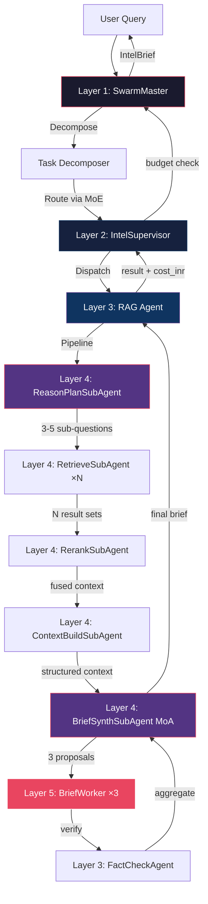

# Chapter 2: Complete Swarm Topology v9.0

## 7-Layer Hierarchical Swarm (Improvised from v8.0's 5 layers)

```
╔══════════════════════════════════════════════════════════════════════════════════╗
║                   GEOSUPPLY AI — COMPLETE SWARM TOPOLOGY v9.0                  ║
╠══════════════════════════════════════════════════════════════════════════════════╣
║                                                                                 ║
║  LAYER 0 — HUMAN OPERATOR                                                      ║
║  ┌──────────────────────┐  ┌──────────────────────────────────────────────┐    ║
║  │  Claude Chat          │  │  Google Antigravity                          │    ║
║  │  Architecture Review  │  │  Writes code, runs pytest, commits GitHub    │    ║
║  │  Grading + Cost (INR) │  │  Spawns 6 parallel agents max               │    ║
║  └──────────────────────┘  └──────────────────────────────────────────────┘    ║
║                                      │                                          ║
║  ════════════════════════════════════════════════════════════════════════════    ║
║                                                                                 ║
║  LAYER 1 — ORCHESTRATOR (SwarmMaster) ◄── NEW: Dedicated orchestration layer   ║
║  ┌──────────────────────────────────────────────────────────────────────────┐  ║
║  │  ┌─────────────┐  ┌──────────────┐  ┌────────────────┐                  │  ║
║  │  │ MoE Gating   │  │ Task         │  │ Dependency     │                  │  ║
║  │  │ Network      │  │ Decomposer   │  │ Resolver       │                  │  ║
║  │  └─────────────┘  └──────────────┘  └────────────────┘                  │  ║
║  │  ┌─────────────┐  ┌──────────────┐  ┌────────────────┐                  │  ║
║  │  │ Budget Mgr   │  │ Session      │  │ ColdStart      │                  │  ║
║  │  │ (INR caps)   │  │ Coordinator  │  │ Guard          │                  │  ║
║  │  └─────────────┘  └──────────────┘  └────────────────┘                  │  ║
║  │  ┌─────────────┐  ┌──────────────┐  ┌────────────────┐ ◄── NEW         │  ║
║  │  │ Pipeline     │  │ Routing      │  │ Backpressure   │                  │  ║
║  │  │ Rectifier    │  │ Advisor      │  │ Controller     │                  │  ║
║  │  └─────────────┘  └──────────────┘  └────────────────┘                  │  ║
║  └──────────────────────────────────────────────────────────────────────────┘  ║
║                                      │                                          ║
║  ════════════════════════════════════════════════════════════════════════════    ║
║                                                                                 ║
║  LAYER 2 — SUPERVISORS (10 Tier-Based Managers) ◄── NEW: Separated from agents ║
║  ┌───────────┐ ┌───────────┐ ┌───────────┐ ┌───────────┐ ┌───────────┐       ║
║  │ Ingest    │ │ NLP       │ │ Intel     │ │ ML        │ │ India     │       ║
║  │ Supervisor│ │ Supervisor│ │ Supervisor│ │ Supervisor│ │ Supervisor│       ║
║  │ ┈┈┈┈┈┈┈┈ │ │ ┈┈┈┈┈┈┈┈ │ │ ┈┈┈┈┈┈┈┈ │ │ ┈┈┈┈┈┈┈┈ │ │ ┈┈┈┈┈┈┈┈ │       ║
║  │ WorkSteal │ │ PriQueue  │ │ MoA Ctrl  │ │ Retrain   │ │ NDA Gate  │       ║
║  │ BudgetGate│ │ BudgetGate│ │ BudgetGate│ │ BudgetGate│ │ BudgetGate│       ║
║  └───────────┘ └───────────┘ └───────────┘ └───────────┘ └───────────┘       ║
║  ┌───────────┐ ┌───────────┐ ┌───────────┐ ┌───────────┐ ┌───────────┐       ║
║  │ Dashboard │ │ Infra     │ │ Quality   │ │ Dev       │ │ Test      │       ║
║  │ Supervisor│ │ Supervisor│ │ Supervisor│ │ Supervisor│ │ Supervisor│       ║
║  │ ┈┈┈┈┈┈┈┈ │ │ ┈┈┈┈┈┈┈┈ │ │ ┈┈┈┈┈┈┈┈ │ │ ┈┈┈┈┈┈┈┈ │ │ ┈┈┈┈┈┈┈┈ │       ║
║  │ PageRoute │ │ Singleton │ │ FactCheck │ │ PhaseGate │ │ Coverage  │       ║
║  │ BudgetGate│ │ Lifecycle │ │ Pipeline  │ │ BuildOrder│ │ Regression│       ║
║  └───────────┘ └───────────┘ └───────────┘ └───────────┘ └───────────┘       ║
║                                      │                                          ║
║  ════════════════════════════════════════════════════════════════════════════    ║
║                                                                                 ║
║  LAYER 3 — AGENTS (15 Domain + Infrastructure) ◄── NEW: Capability-advertising ║
║  ┌────────────────────────────────────────────────────────────────────────┐    ║
║  │ INFRASTRUCTURE AGENTS (6 singletons — always on, off critical path)    │    ║
║  │ ┌──────────┐┌───────────┐┌────────────┐┌──────────┐┌────────┐┌──────┐│    ║
║  │ │LoggingAgt││FactCheckAg││HealthChkAgt││SecurityAg││AuditAgt││SrcFb ││    ║
║  │ │ @single  ││ 0.70 floor││ 28 APIs    ││ get_key()││Stratify││-0.05 ││    ║
║  │ └──────────┘└───────────┘└────────────┘└──────────┘└────────┘└──────┘│    ║
║  ├────────────────────────────────────────────────────────────────────────┤    ║
║  │ DEV AGENTS (4 — build-time only)                                       │    ║
║  │ ┌────────────┐ ┌──────────────┐ ┌──────────┐ ┌─────────────┐         │    ║
║  │ │ScaffoldAgt │ │CodeReviewAgt │ │DocGenAgt │ │RefactorAgt  │         │    ║
║  │ └────────────┘ └──────────────┘ └──────────┘ └─────────────┘         │    ║
║  ├────────────────────────────────────────────────────────────────────────┤    ║
║  │ TEST AGENTS (5 — build + production)                                   │    ║
║  │ ┌──────────┐┌───────────┐┌──────────┐┌────────────┐┌──────────────┐  │    ║
║  │ │UnitTest  ││IntegTest  ││LoadTest  ││Regression  ││ContractTest  │  │    ║
║  │ │80% gate  ││8 scenarios││<12min SLA││Baseline cmp││Schema valid  │  │    ║
║  │ └──────────┘└───────────┘└──────────┘└────────────┘└──────────────┘  │    ║
║  └────────────────────────────────────────────────────────────────────────┘    ║
║                                      │                                          ║
║  ════════════════════════════════════════════════════════════════════════════    ║
║                                                                                 ║
║  LAYER 4 — SUBAGENTS (8 Composable Pipelines) ◄── NEW LAYER                   ║
║  ┌──────────────┐ ┌────────────────┐ ┌──────────────┐ ┌─────────────────┐    ║
║  │ReasonPlan    │ │RetrieveSub     │ │RerankSub     │ │ContextBuild     │    ║
║  │ (RAG Step 1) │ │ (RAG Step 2)   │ │ (RAG Step 3) │ │ (RAG Step 5)    │    ║
║  └──────────────┘ └────────────────┘ └──────────────┘ └─────────────────┘    ║
║  ┌──────────────┐ ┌────────────────┐ ┌──────────────┐ ┌─────────────────┐    ║
║  │BriefSynth    │ │SourceFeedback  │ │SemanticDrift  │ │HallucinCheck    │    ║
║  │ (MoA×3+Agg)  │ │ (-0.05 penalty)│ │ (KL weekly)   │ │ (7-step 0.70)   │    ║
║  └──────────────┘ └────────────────┘ └──────────────┘ └─────────────────┘    ║
║                                      │                                          ║
║  ════════════════════════════════════════════════════════════════════════════    ║
║                                                                                 ║
║  LAYER 5 — WORKERS (32 Expert Executors)                                       ║
║  INGESTION(4): NewsWkr  IndiaAPIWkr  TelegramWkr  AISWkr                      ║
║  NLP(5):       LangWkr  TranslWkr  SentimentWkr⚡ NERWkr⚡ EmbedWkr           ║
║  INTEL(7):     ClaimWkr⚡ VerifierWkr  SrcCredWkr⚡ AuthorWkr                  ║
║                NetworkWkr  CIBWkr  PropagandaWkr                               ║
║  ML(3):        ConflictWkr  RetrainWkr  DriftWkr                               ║
║  RAG(3):       RAGWkr(fixed)  GraphRAGWkr  BriefWkr(MoA)                      ║
║  SUPPLY(3):    StressWkr  SupplierWkr⚡ SanctionsWkr⚡                         ║
║  INDIA(2):     IndiaIntelWkr  MonsoonWkr                                       ║
║  DASHBOARD(2): StreamlitWkr  CIVisWkr                                          ║
║  DEV(4)+TEST(5): (listed in Layer 3 Agents above)                              ║
║                                                                                 ║
║  ⚡ = STATIC decoder mandatory (Tier-1 schema-strict)                           ║
║                                                                                 ║
║  ════════════════════════════════════════════════════════════════════════════    ║
║                                                                                 ║
║  LAYER 6 — MODEL & SKILL POOL                                                  ║
║  PC RTX5060: GPT-OSS:20b  qwen2.5:14b     Mon-Thu 10am-6pm   INR 0            ║
║  Groq API:   Llama3.3:70b qwen-qwq-32b    24/7 free          INR 0            ║
║  GCP T4:     qwen2.5:14b                  INR 840 credit      INR 0            ║
║  Claude API: claude-sonnet-4-6            Emergency only      INR 0.25/call    ║
║  CPU:        sentence-transformers  XGBoost  fasttext          INR 0            ║
║  STATIC:     CSR-matrix constrained decoder  All Tier1 schema  INR 0            ║
║  ┈┈┈┈┈┈┈┈┈┈┈┈┈┈┈┈┈┈┈┈┈┈┈┈┈┈┈┈┈┈┈┈┈┈┈┈┈┈┈┈┈┈┈┈┈┈┈┈┈┈┈┈┈┈┈┈┈┈┈┈┈┈┈┈┈┈┈┈   ║
║  SKILLS(14): python-conventions  india-apis  llm-routing  circuit-breaker      ║
║              rag-patterns  testing-standards  multilingual-nlp  fact-checking   ║
║              supply-chain  security  moe-gateway  logging-integration          ║
║              infra-agents  dashboard-patterns                                   ║
╚══════════════════════════════════════════════════════════════════════════════════╝
```

---

## Data Flow: Query → IntelBrief (End-to-End)



---

## Communication Patterns

### Vertical (Hierarchical)
```
Orchestrator ──dispatch──► Supervisor ──assign──► Agent ──run──► SubAgent ──exec──► Worker
Worker ───────result──────► SubAgent ──result──► Agent ──report─► Supervisor ──report─► Orchestrator
```

### Horizontal (Event Bus — NEW in v9)
```
FactCheckAgent ──quarantine_event──► EventBus ──notify──► SourceFeedbackSubAgent
HealthCheckAgent ──alert_event──► EventBus ──notify──► SwarmMaster (DEGRADED_MODE)
AuditorAgent ──drift_event──► EventBus ──notify──► RoutingAdvisor (tier escalation)
Worker.any ──cost_event──► EventBus ──aggregate──► BudgetManager
```

### No Lateral (LOCKED — Same as v8)
```
Manager-to-Manager: FORBIDDEN
Worker-to-Worker (different domain): FORBIDDEN
Only through shared EventBus or upward through hierarchy
```
