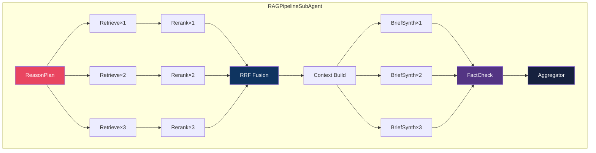

# Chapter 4: Sub-Agent Layer — Composable Pipeline Patterns

## Design Philosophy

> **A SubAgent is a pipeline, not a function. It composes Workers into directed workflows.**

This is a **NEW layer in v9.0**. In v8, sub-agents were implicit inline code inside managers. In v9, they are first-class citizens with their own base class, DAG execution, parallel fan-out, and per-step cost tracking.

---

## BaseSubAgent Abstract Class

```python
from abc import ABC, abstractmethod
from typing import TypeVar, Generic, Optional
from pydantic import BaseModel
from dataclasses import dataclass, field
from enum import Enum
import asyncio
import time

class StepType(Enum):
    SEQUENTIAL = "sequential"
    PARALLEL = "parallel"
    CONDITIONAL = "conditional"

@dataclass
class PipelineStep:
    """A single step in the SubAgent pipeline."""
    name: str
    worker_class: type           # Which worker to invoke
    step_type: StepType          # Sequential, parallel, or conditional
    condition: Optional[callable] = None  # For CONDITIONAL steps
    timeout_sec: float = 30.0
    required: bool = True        # If False, failure skips (doesn't kill pipeline)

class PipelineResult(BaseModel):
    status: str
    steps_completed: int
    steps_total: int
    total_cost_inr: float
    total_latency_ms: float
    step_results: list[dict]
    final_output: dict

class BaseSubAgent(ABC):
    """
    Base class for all composable pipeline sub-agents.

    A SubAgent defines a PIPELINE of steps. Each step invokes one or more
    Workers. Steps can be sequential, parallel (fan-out), or conditional.

    EXECUTION MODEL:
        define_pipeline() → returns ordered list of PipelineStep
        run()            → executes pipeline with error propagation
                           returns PipelineResult with per-step costs

    KEY FEATURES:
        - DAG execution:    steps form a directed acyclic graph
        - Parallel fan-out: PARALLEL steps invoke N workers simultaneously
        - Error propagation: required step fails → pipeline aborts
        - Cost aggregation: every step's INR cost rolled up
        - Skip on failure:  non-required steps can fail gracefully
    """

    name: str = "UnnamedSubAgent"

    def __init__(self, session_id: str):
        self.session_id = session_id
        self._step_results: list[dict] = []
        self._total_cost_inr = 0.0

    @abstractmethod
    def define_pipeline(self) -> list[PipelineStep]:
        """Define the ordered pipeline steps. Subclass MUST implement."""
        ...

    async def run(self, input_data: BaseModel) -> PipelineResult:
        """Execute the full pipeline."""
        pipeline = self.define_pipeline()
        start = time.perf_counter()
        current_data = input_data

        for i, step in enumerate(pipeline):
            try:
                if step.step_type == StepType.CONDITIONAL:
                    if step.condition and not step.condition(current_data):
                        continue  # Skip this step

                if step.step_type == StepType.PARALLEL:
                    current_data = await self._run_parallel(step, current_data)
                else:
                    current_data = await self._run_sequential(step, current_data)

                self._step_results.append({
                    "step": step.name,
                    "status": "success",
                    "cost_inr": getattr(current_data, 'cost_inr', 0)
                })

            except Exception as e:
                if step.required:
                    return PipelineResult(
                        status="error",
                        steps_completed=i,
                        steps_total=len(pipeline),
                        total_cost_inr=self._total_cost_inr,
                        total_latency_ms=(time.perf_counter() - start) * 1000,
                        step_results=self._step_results,
                        final_output={"error": str(e), "failed_step": step.name}
                    )
                else:
                    self._step_results.append({
                        "step": step.name,
                        "status": "skipped",
                        "error": str(e)
                    })

        elapsed = (time.perf_counter() - start) * 1000
        return PipelineResult(
            status="success",
            steps_completed=len(pipeline),
            steps_total=len(pipeline),
            total_cost_inr=self._total_cost_inr,
            total_latency_ms=elapsed,
            step_results=self._step_results,
            final_output=current_data.model_dump() if hasattr(current_data, 'model_dump') else {}
        )

    async def _run_parallel(self, step, input_data):
        """Fan-out: invoke multiple worker instances simultaneously."""
        # Creates N worker instances for N sub-tasks
        # Gathers results concurrently
        # Returns merged output
        ...

    async def _run_sequential(self, step, input_data):
        """Chain: one worker, one input, one output."""
        worker = step.worker_class(session_id=self.session_id)
        worker.setup()
        result = worker.execute(input_data)
        worker.teardown()
        self._total_cost_inr += result.meta.cost_inr
        return result
```

---

## Concrete SubAgent: Fixed RAG Pipeline

```python
class RAGPipelineSubAgent(BaseSubAgent):
    """
    The FIXED RAG pipeline from v8.0 P0, now as a first-class SubAgent.
    Plan → Parallel Retrieve → Rerank → RRF Fuse → Context Build → MoA Synth
    """
    name = "RAGPipelineSubAgent"

    def define_pipeline(self) -> list[PipelineStep]:
        return [
            PipelineStep(
                name="plan",
                worker_class=ReasonPlanWorker,  # GPT-OSS:20b
                step_type=StepType.SEQUENTIAL,
                timeout_sec=15.0
            ),
            PipelineStep(
                name="parallel_retrieve",
                worker_class=RetrieveWorker,    # ChromaDB ×N
                step_type=StepType.PARALLEL,     # ◄── Fan-out per sub-question
                timeout_sec=10.0
            ),
            PipelineStep(
                name="rerank",
                worker_class=RerankWorker,      # Cross-encoder
                step_type=StepType.PARALLEL,     # Per result set
                timeout_sec=8.0
            ),
            PipelineStep(
                name="rrf_fusion",
                worker_class=RRFFusionWorker,   # Reciprocal Rank Fusion
                step_type=StepType.SEQUENTIAL,
                timeout_sec=5.0
            ),
            PipelineStep(
                name="context_build",
                worker_class=ContextBuildWorker, # TTL + token budget
                step_type=StepType.SEQUENTIAL,
                timeout_sec=5.0
            ),
            PipelineStep(
                name="moa_synthesis",
                worker_class=BriefSynthWorker,   # 3 proposers + aggregator
                step_type=StepType.PARALLEL,      # 3 parallel proposals
                timeout_sec=45.0
            ),
        ]
```

---

## Complete SubAgent Inventory (8 SubAgents)

| # | SubAgent | Pipeline Steps | Trigger | Model Tier |
|---|----------|---------------|---------|------------|
| 1 | ReasonPlanSubAgent | Query → 3-5 sub-questions | RAGWorker | Tier 3 |
| 2 | RetrieveSubAgent | Sub-question → ChromaDB results | RAGPipeline | Tier 0 |
| 3 | RerankSubAgent | Results → cross-encoder ranked | RAGPipeline | Tier 0 |
| 4 | ContextBuildSubAgent | Fused results → token-budgeted context | RAGPipeline | Tier 0 |
| 5 | BriefSynthSubAgent | Context → 3×MoA → FactCheck → Final | RAGPipeline | Tier 3 |
| 6 | SourceFeedbackSubAgent | Quarantine event → source penalty | FactCheckAgent | Tier 1 ⚡ |
| 7 | SemanticDriftMonitor | Weekly sample → KL-divergence check | AuditorAgent | Tier 2 |
| 8 | HallucinationCheckSubAgent | LLM output → 7-step verification | QualitySupervisor | Tier 3 |

---

## SubAgent Composition Diagram


