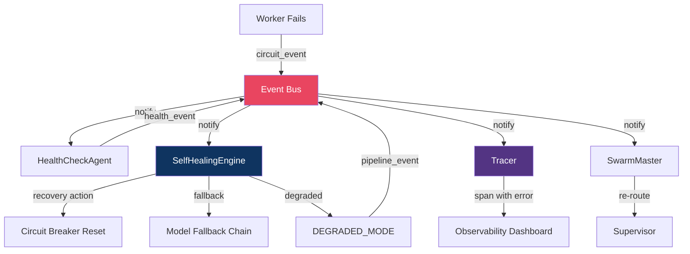

# Chapter 9: Modern Agentic Patterns

## New in v9.0 — Three Pillars of Modern Agent Infrastructure

---

## Pillar 1: Event Bus — Decoupled Agent Communication

### Why?
In v8, agents communicate only vertically (Worker → Manager → Orchestrator). Horizontal events (e.g., "source quarantined" → trigger penalty) are hardcoded as direct function calls. This creates tight coupling.

### Design

```python
from dataclasses import dataclass, field
from typing import Callable, Any
from datetime import datetime
from collections import defaultdict
import asyncio

@dataclass
class Event:
    topic: str                    # e.g. "quarantine", "cost_alert", "health"
    source: str                   # e.g. "FactCheckAgent"
    payload: dict                 # Arbitrary event data
    timestamp: datetime = field(default_factory=datetime.utcnow)
    event_id: str = ""           # UUID
    priority: int = 5            # 0=highest

class EventBus:
    """
    Async topic-based pub/sub for decoupled agent communication.

    NEW IN v9 — replaces hardcoded cross-agent calls.

    FEATURES:
        - Topic-based subscriptions with filtering
        - Dead letter queue for failed handlers
        - Event replay for debugging
        - Priority ordering within topics
        - At-least-once delivery guarantee
    """

    def __init__(self):
        self._subscribers: dict[str, list[Callable]] = defaultdict(list)
        self._dead_letters: list[Event] = []
        self._event_log: list[Event] = []  # For replay

    def subscribe(self, topic: str, handler: Callable) -> None:
        """Subscribe a handler to a topic."""
        self._subscribers[topic].append(handler)

    async def publish(self, event: Event) -> None:
        """Publish event to all subscribers of its topic."""
        self._event_log.append(event)
        handlers = self._subscribers.get(event.topic, [])

        for handler in handlers:
            try:
                await handler(event)
            except Exception as e:
                self._dead_letters.append(event)
                # LoggingAgent.log("event_handler_failed", ...)

    async def replay(self, topic: str, since: datetime) -> list[Event]:
        """Replay events for debugging."""
        return [e for e in self._event_log
                if e.topic == topic and e.timestamp >= since]
```

### Event Topology

```
DEFINED EVENT FLOWS:

quarantine_event:
    Publisher: FactCheckAgent
    Subscribers: SourceFeedbackSubAgent, LoggingAgent, AuditorAgent
    Payload: {claim_id, source_id, score, reason}

cost_alert_event:
    Publisher: Any Worker (via BaseWorker._track_cost)
    Subscribers: BudgetManager, LoggingAgent, HealthCheckAgent
    Payload: {agent, cost_inr, period, threshold_exceeded}

health_event:
    Publisher: HealthCheckAgent
    Subscribers: SwarmMaster, InfraSupervisor
    Payload: {service, status, latency_ms, error}

drift_event:
    Publisher: AuditorAgent, SemanticDriftMonitor
    Subscribers: RoutingAdvisor, SwarmMaster
    Payload: {worker, drift_vector, kl_divergence, recommendation}

circuit_event:
    Publisher: CircuitBreaker
    Subscribers: HealthCheckAgent, SelfHealingEngine
    Payload: {api_name, state: OPEN|HALF_OPEN|CLOSED, failure_count}

pipeline_event:
    Publisher: PipelineRectifier
    Subscribers: SwarmMaster, LoggingAgent
    Payload: {pipeline_id, stage, status, incident_record}
```

---

## Pillar 2: Distributed Observability

### Why?
In v8, LoggingAgent logs events but there's no way to trace a request across the entire swarm. If a brief generation takes 45 seconds, you can't tell which worker/subagent/agent consumed the time or cost.

### Design

```python
import uuid
from dataclasses import dataclass, field
from typing import Optional
from contextlib import contextmanager
import time

@dataclass
class Span:
    """A single unit of work in the distributed trace."""
    trace_id: str           # Shared across entire request
    span_id: str            # Unique to this span
    parent_span_id: Optional[str]
    operation: str           # e.g. "SentimentWorker.process"
    layer: str              # "worker" | "subagent" | "agent" | "supervisor" | "orchestrator"
    start_time: float
    end_time: Optional[float] = None
    cost_inr: float = 0.0
    status: str = "ok"
    tags: dict = field(default_factory=dict)

class Tracer:
    """
    Distributed tracing across the entire swarm.
    Every request gets a trace_id. Every layer creates spans.

    TRACE HIERARCHY:
        SwarmMaster.handle_query        [trace root span]
          └─ IntelSupervisor.dispatch   [supervisor span]
              └─ RAGAgent.execute       [agent span]
                  └─ RAGPipeline.run    [subagent span]
                      ├─ ReasonPlan     [worker span]
                      ├─ Retrieve×3     [worker spans, parallel]
                      ├─ Rerank×3       [worker spans, parallel]
                      ├─ RRFFusion      [worker span]
                      ├─ ContextBuild   [worker span]
                      └─ BriefSynth×3   [worker spans, MoA]

    INR ATTRIBUTION:
        Each span tracks cost_inr.
        Total request cost = sum of all leaf span costs.
        Cost waterfall visible in Streamlit dashboard.
    """

    def __init__(self):
        self._spans: dict[str, list[Span]] = {}

    def start_trace(self) -> str:
        trace_id = str(uuid.uuid4())
        self._spans[trace_id] = []
        return trace_id

    @contextmanager
    def span(self, trace_id: str, operation: str, layer: str,
             parent_span_id: str = None):
        """Context manager for creating spans."""
        span = Span(
            trace_id=trace_id,
            span_id=str(uuid.uuid4()),
            parent_span_id=parent_span_id,
            operation=operation,
            layer=layer,
            start_time=time.perf_counter()
        )
        try:
            yield span
        except Exception as e:
            span.status = "error"
            span.tags["error"] = str(e)
            raise
        finally:
            span.end_time = time.perf_counter()
            self._spans[trace_id].append(span)

    def get_trace(self, trace_id: str) -> list[Span]:
        return self._spans.get(trace_id, [])

    def get_cost_waterfall(self, trace_id: str) -> dict:
        """INR cost breakdown by layer."""
        spans = self.get_trace(trace_id)
        waterfall = {"worker": 0, "subagent": 0, "agent": 0,
                     "supervisor": 0, "orchestrator": 0}
        for span in spans:
            waterfall[span.layer] += span.cost_inr
        return waterfall
```

---

## Pillar 3: Self-Healing Engine

### Why?
In v8, HealthCheckAgent monitors and alerts, but recovery is manual. In v9, the SelfHealingEngine automatically recovers from common failure modes.

### Design

```python
class SelfHealingEngine:
    """
    Automated recovery from common failure patterns.

    RECOVERY ACTIONS (ordered by severity):
        1. Clear stale circuit breakers (30min+ in OPEN state)
        2. Flush stuck ChromaDB write queue (depth > 200)
        3. Restart failed FastAPI processes
        4. Force model fallback (PC→Groq→Claude)
        5. Activate DEGRADED_MODE levels (1→2→3→4)

    TRIGGERS (from EventBus):
        circuit_event with state=OPEN for >30min → Action 1
        health_event with queue_depth>200 → Action 2
        health_event with service_down → Action 3
        cost_alert_event → Action 5

    SAFEGUARDS:
        Max 3 recovery attempts per issue per hour
        All actions logged to LoggingAgent
        DEGRADED_MODE cannot be auto-exited (requires human)
    """

    RECOVERY_STRATEGIES = {
        "circuit_stale": {
            "action": "reset_circuit_breaker",
            "condition": "circuit OPEN for >30 minutes",
            "max_attempts": 3,
            "cooldown_minutes": 60
        },
        "queue_overflow": {
            "action": "flush_write_queue",
            "condition": "ChromaDB queue depth > 200",
            "max_attempts": 2,
            "cooldown_minutes": 30
        },
        "process_crash": {
            "action": "restart_process",
            "condition": "FastAPI health check fails 3x",
            "max_attempts": 3,
            "cooldown_minutes": 15
        },
        "model_unavailable": {
            "action": "activate_fallback_chain",
            "condition": "Primary model endpoint unreachable",
            "max_attempts": 1,
            "cooldown_minutes": 5
        },
        "budget_exceeded": {
            "action": "enter_degraded_mode",
            "condition": "INR budget threshold crossed",
            "max_attempts": 1,
            "cooldown_minutes": 0  # Immediate
        }
    }

    async def on_event(self, event: Event) -> None:
        """Handle events and trigger recovery if needed."""
        strategy = self._match_strategy(event)
        if strategy and self._can_attempt(strategy):
            await self._execute_recovery(strategy, event)
```

---

## Integration: How the Three Pillars Work Together


