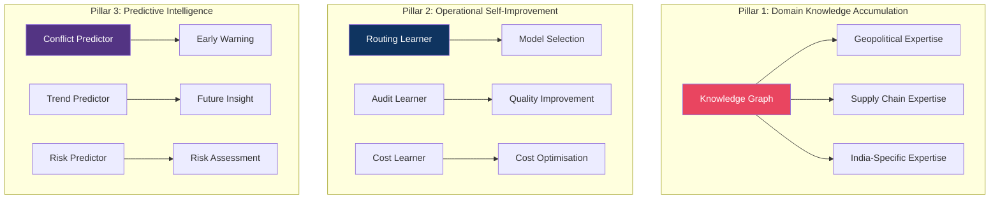

# Chapter 14: Self-Learning Intelligence Engine

## Design Philosophy

> **The system doesn't just process intelligence — it BECOMES more intelligent over time.**
> Every pipeline run makes it smarter about geopolitics, supply chains, and its own performance.

---

## Three Pillars of Self-Learning



---

## Pillar 1: Domain Knowledge Accumulation

### KnowledgeGraphAgent (NEW in v9)

```python
class KnowledgeGraphAgent:
    """
    Builds and maintains a persistent knowledge graph that
    grows smarter with every pipeline run.

    WHAT IT LEARNS:
        - Entity relationships (countries, companies, ports, routes)
        - Geopolitical event patterns (sanctions → supply disruption)
        - Supply chain topology (chokepoints, alternatives, dependencies)
        - Source reliability over time (which sources are consistently right)
        - Temporal patterns (monsoon → port disruption every year)

    STORAGE:
        NetworkX graph in memory (fast queries)
        Persisted to SQLite knowledge_graph table (durability)
        Embedded in ChromaDB (semantic search over knowledge)

    GROWTH CYCLE:
        Every 6-hour pipeline run:
            1. Extract entities + relations from new articles
            2. Merge into existing knowledge graph
            3. Update edge weights (strength of relationships)
            4. Decay old edges (reduce weight by 0.01/week)
            5. Identify NEW patterns not seen before → log as insight
    """

    def __init__(self):
        self.graph = nx.DiGraph()  # Persistent knowledge graph
        self._insight_log: list[dict] = []

    def learn_from_pipeline(self, pipeline_output: dict) -> list[dict]:
        """Called after every 6-hour pipeline run."""
        entities = self._extract_entities(pipeline_output)
        relations = self._extract_relations(pipeline_output)

        new_insights = []
        for entity in entities:
            if entity not in self.graph:
                self.graph.add_node(entity.id, **entity.metadata)

        for relation in relations:
            if self.graph.has_edge(relation.source, relation.target):
                # Strengthen existing relationship
                self.graph[relation.source][relation.target]['weight'] += 0.1
                self.graph[relation.source][relation.target]['last_seen'] = datetime.utcnow()
            else:
                # NEW relationship discovered
                self.graph.add_edge(relation.source, relation.target,
                                   weight=1.0, type=relation.type,
                                   first_seen=datetime.utcnow(),
                                   last_seen=datetime.utcnow())
                new_insights.append({
                    "type": "new_relationship",
                    "source": relation.source,
                    "target": relation.target,
                    "relation": relation.type,
                    "confidence": relation.confidence
                })

        self._insight_log.extend(new_insights)
        return new_insights

    def query_expertise(self, topic: str) -> dict:
        """Ask the knowledge graph about a topic."""
        # Semantic search + graph traversal
        # Returns: related entities, relationships, historical patterns
        ...

    def get_geopolitical_context(self, country: str) -> dict:
        """Get accumulated geopolitical intelligence about a country."""
        neighbors = list(self.graph.neighbors(country))
        return {
            "allies": [n for n in neighbors if self.graph[country][n]['type'] == 'ally'],
            "rivals": [n for n in neighbors if self.graph[country][n]['type'] == 'rival'],
            "trade_partners": [n for n in neighbors if self.graph[country][n]['type'] == 'trade'],
            "supply_routes": [n for n in neighbors if self.graph[country][n]['type'] == 'route'],
            "risk_factors": self._get_risk_factors(country),
            "historical_patterns": self._get_patterns(country),
        }
```

### Expertise Domains — What It Learns

```
GEOPOLITICS EXPERTISE:
    ├── Conflict patterns (LAC tension → trade disruption timeline)
    ├── Sanctions cascading effects (entity sanctioned → supplier alternatives)
    ├── Alliance shifts (new trade agreements → route changes)
    ├── Election impact patterns (election → policy uncertainty → market reaction)
    ├── Propaganda source identification (which channels push narratives)
    └── State-media linguistic fingerprints (per-country propaganda patterns)

SUPPLY CHAIN EXPERTISE:
    ├── Chokepoint vulnerability scoring (Suez, Strait of Malacca, CPEC)
    ├── Alternative route discovery (if route X blocked, route Y/Z available)
    ├── Supplier dependency mapping (single-source risks)
    ├── Seasonal disruption patterns (monsoon+port delays, winter+shipping)
    ├── Container flow optimization (LDB 91M+ records → flow patterns)
    └── Critical mineral supply chains (India-specific rare earth dependencies)

INDIA-SPECIFIC EXPERTISE:
    ├── Monsoon-port correlation (IMD data → port delay prediction)
    ├── DGFT policy impact on trade flows
    ├── ULIP logistics patterns (129 APIs → cross-ministry insights)
    ├── INR forex stress → import cost prediction
    ├── India-China trade matrix evolution
    └── CPEC vs IMEC corridor development tracking
```

---

## Pillar 2: Operational Self-Improvement

### PerformanceLearnerAgent (NEW in v9)

```python
class PerformanceLearnerAgent:
    """
    Learns from the system's own operational history to improve
    routing, model selection, and cost efficiency.

    NOT reinforcement learning — structured lookup with decay.

    WHAT IT TRACKS:
        1. Model performance per task type per language
        2. Latency patterns (which models are faster when)
        3. Cost efficiency (cost-per-quality-point)
        4. Error patterns (which workers fail on which inputs)
        5. Audit pass rates (which workers are improving/degrading)

    OUTPUTS:
        - RoutingAdvisorRecords (escalate/de-escalate task routing)
        - Model preference updates (prefer model X for task Y)
        - Worker reliability scores (used by Supervisors)
        - Cost optimization suggestions (move task from Tier-3 to Tier-2)
    """

    def learn_from_run(self, trace: list['Span']) -> list[dict]:
        """Analyze a completed trace and extract learnings."""
        learnings = []

        for span in trace:
            # Track: task_type → model → quality → latency → cost
            record = {
                "task_type": span.tags.get("task_type"),
                "model": span.tags.get("model"),
                "quality_score": span.tags.get("confidence", 1.0),
                "latency_ms": (span.end_time - span.start_time) * 1000,
                "cost_inr": span.cost_inr,
                "status": span.status,
            }

            # Check if a lower tier could handle this equally well
            if record["quality_score"] > 0.95 and record["model"] in TIER_3_MODELS:
                learnings.append({
                    "type": "downgrade_candidate",
                    "task_type": record["task_type"],
                    "from_tier": 3,
                    "to_tier": 2,
                    "reason": "consistently high quality — Tier-2 may suffice"
                })

            # Check if current tier is underperforming
            if record["quality_score"] < 0.70:
                learnings.append({
                    "type": "upgrade_candidate",
                    "task_type": record["task_type"],
                    "recommendation": "escalate_to_higher_tier"
                })

        return learnings
```

---

## Pillar 3: Predictive Intelligence

### FutureProofing — Anticipatory Analysis

```
EARLY WARNING SYSTEM:
    ConflictPredictor (XGBoost) evolves its features:
        Week 1-4:  Base features (ACLED, GDELT, sentiment)
        Week 5-8:  + Knowledge graph features (relationship changes)
        Week 9-12: + Temporal features (seasonal patterns, election cycles)
        Week 13+:  + Cross-domain features (supply chain stress + geopolitics)

    Each weekly retrain:
        1. Add features from knowledge graph
        2. Retrain XGBoost with expanded feature set
        3. Platt calibrate for INR-denominated risk scoring
        4. Compare F1 vs baseline — only deploy if improvement
        5. Log feature importance changes → insight log

TREND DETECTION:
    Weekly analysis by SemanticDriftMonitor:
        1. Compare this week's entity/topic distribution vs last 4 weeks
        2. Identify RISING topics (new entities appearing frequently)
        3. Identify DECLINING topics (entities disappearing)
        4. Flag ANOMALIES (sudden spikes in previously rare topics)
        5. Generate "Week Ahead" predictive brief

SCENARIO SIMULATION:
    Monthly scenario runs by IntelSupervisor:
        "What if Strait of Malacca blocked?" → supply chain cascade
        "What if INR drops 10%?" → import cost impact
        "What if LAC tension escalates?" → trade flow disruption
        Uses knowledge graph + XGBoost + RAG for comprehensive analysis
```

---

## Learning Feedback Loops

```
LOOP 1 — Source Quality Loop (existing v8, improved v9):
    Source produces article → FactCheck → Quarantine?
    → SourceFeedbackSubAgent → penalty/recovery
    → KnowledgeGraphAgent updates source reliability node
    → Future RAG retrieval downweights unreliable sources

LOOP 2 — Model Routing Loop (new v9):
    Task dispatched to Model X → Quality score → Latency → Cost
    → PerformanceLearnerAgent evaluates
    → RoutingAdvisorRecord written if underperforming
    → MoE gate adjusts routing next run

LOOP 3 — Knowledge Accumulation Loop (new v9):
    Pipeline processes 500 articles
    → KnowledgeGraphAgent extracts entities + relations
    → Graph grows (new nodes, stronger edges, new patterns)
    → RAG retrieval uses graph for multi-hop reasoning
    → BriefSynthSubAgent has richer context → better briefs

LOOP 4 — Predictive Loop (new v9):
    XGBoost predicts conflict risk for next 30 days
    → 30 days later, actual events compared to prediction
    → RetrainWorker adjusts model weights
    → Knowledge graph features improve predictions
    → Prediction accuracy improves over time
```
